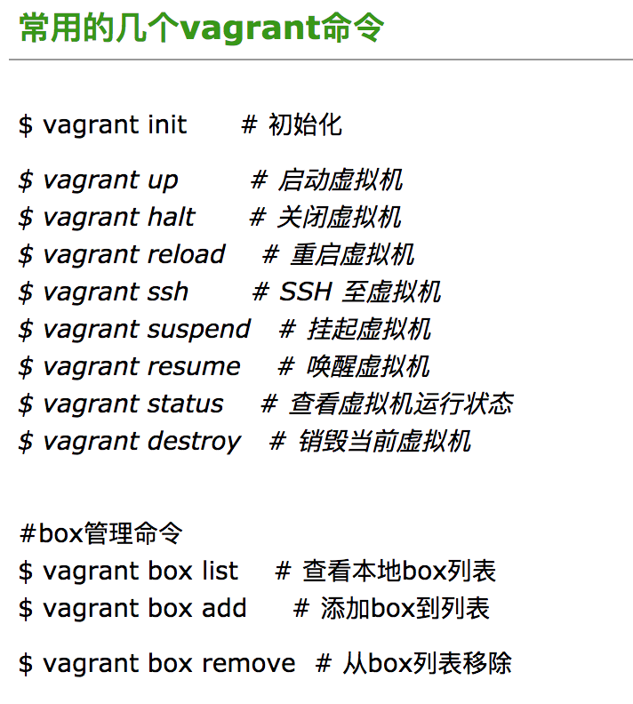

## vagrant 和 gp5的一些基本命令

### vagrant 常用命令


### gp5 常用命令
```
gpstart     # 启动
gpstop     # 停止
gpstop -u     # 修改参数后，不用重启gp
gpstate     # 查看GP运行状态
gprecoverseg     # 恢复挂掉的节点
gprecoverseg -r     # 恢复节点的角色
```